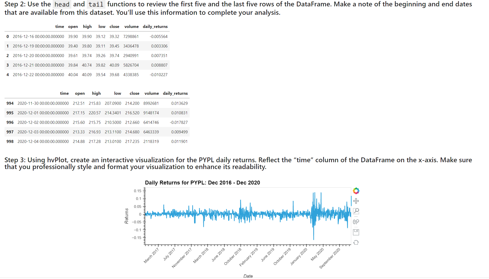
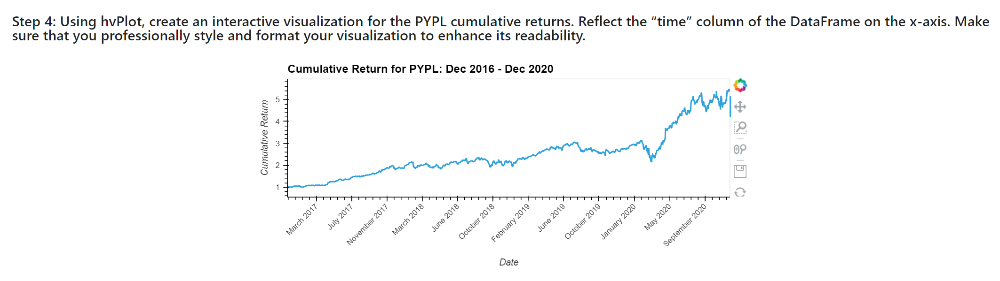
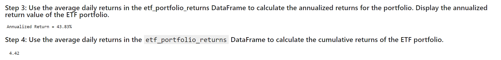

# CFB_Mod7_Challenge
# ETF Analyzer

This is a Python and SQL based tool that analyzes returns from an ETF. The analysis includes pulling ETF data from a SQL database and then analyzing it through advanced SQL queries and Python.  The project also includes the creation of professionally styled visualizations and a web application through Voila.
---

## Technologies

The application is written in Python 3.7 in a Jupyter notebook with support from the following packages:  

*[Pandas] (https://github.com/pandas) - Data Analysis

*[Numpy] (https://github.com/numpy) - Data Analysis

*[SQLAlchemy] (https://github.com/sqlalchemy/sqlalchemy) - SQL Database Queries

*[hvPlot] (https://github.com/hvplot) - Interactive Plotting tools

## Installation Guide

If required, install SQL Alchemy through the command **pip install SQLAlchemy**

Install hvPlot and Geoviews through the command **conda install -c pyviz hvplot geoviews**

Install Voila through the command **conda install -c conda -forge voila**

## Usage and Content

To see the analysis, pls clone the repository and open **etf_analyzer** in JupyterLab.  

There is also a web application created through Voila.  Here are some snapshots from the web application:

## Contributors
Vishnu Kurella, vishnu.kurella@gmail.com

## License
VK.LQA 2021
